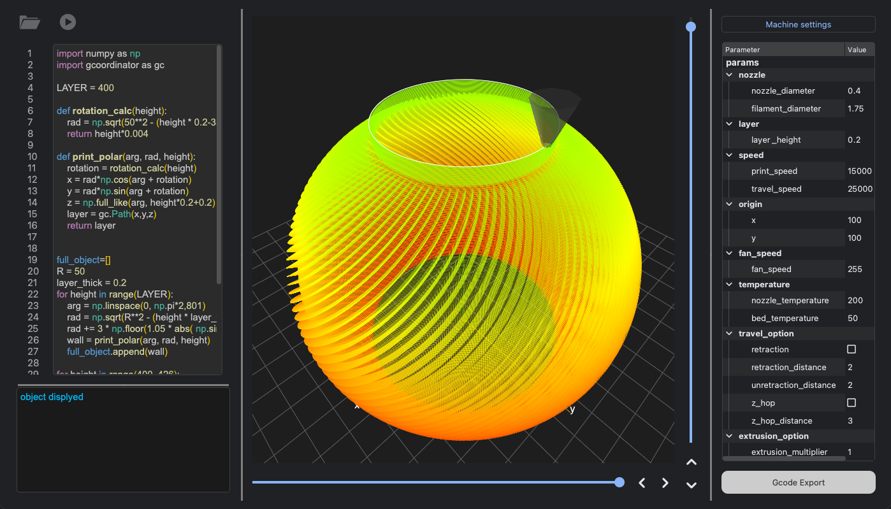
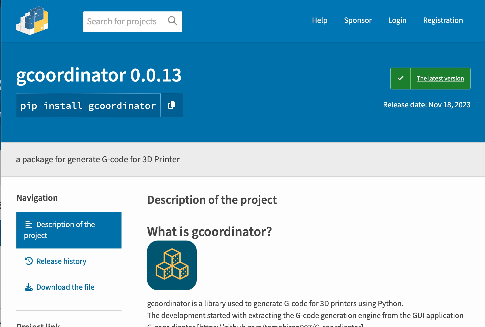

.. gcoordinator documentation master file, created by
   sphinx-quickstart on Tue Nov 14 17:22:33 2023.
   You can adapt this file completely to your liking, but it should at least
   contain the root `toctree` directive.

Welcome to G-coordinator/gcoordinator
========================================

G-coordinator/gcoordinator is 3D printing G-code generation software. 

Using Python, you can make detailed specifications for modeling and printing conditions. 
There are two components:

- gcoordinator: Python library for G-code generation  
- G-coordinator: GUI application for easier utilization.

By installing the GUI app, you can generate G-code without needing a complete Python environment. 
Tasks such as modeling, previewing, and exporting G-code can be accomplished using just the gcoordinator library. 
Depending on your needs, you can choose between the library and the GUI for your workflow.

.. toctree::
   :maxdepth: 1
   :caption: Quick Start:

   installation
   tutorials/pre_start_readings
   tutorials/tutorial_1
   tutorials/tutorial_2
   tutorials/tutorial_3
   tutorials/tutorial_4
   tutorials/tutorial_5
   tutorials/tutorial_6

G-coordinator(GUI application)
------------------------------
https://github.com/tomohiron907/G-coordinator

gcoordinator(python library) 
----------------------------
https://github.com/tomohiron907/gcoordinator

.. toctree::
   :maxdepth: 2
   :caption: Api Reference:

   gcoordinator

.. toctree::
   :maxdepth: 2
   :caption: Release Notes:

   release_notes

Indices and tables
==================

* :ref:`genindex`
* :ref:`modindex`
* :ref:`search`
