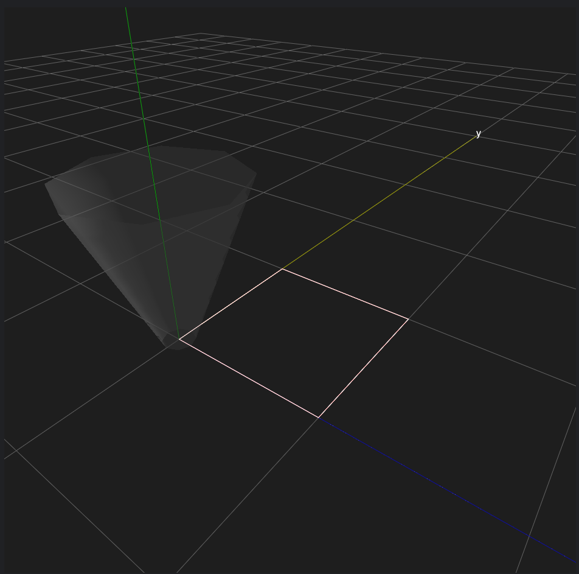

Simple Rectangle
=================

Let's write code to draw a rectangle on a plane. 

First, let's import the gcoordinator library:

.. code-block:: python

    import gcoordinator as gc   

The coordinates for the nozzle's movement are (0, 0, 0), (10, 0, 0), (10, 10, 0), (0, 10, 0), and (0, 0, 0). 
Considering the starting and ending points, we'll sequentially move through these five coordinates.

In gcoordinator, it is necessary to have coordinate sequences for x, y, and z. 
Therefore, we'll create coordinate sequences like the following. 

.. code-block:: python

    x = [0, 10.0, 10.0, 0, 0]
    y = [0, 0, 10.0, 10.0, 0]
    z = [0, 0, 0, 0, 0]
    

From these sequences, we'll create the nozzle path.

.. code-block:: python

    rectangle = gc.path(x, y, z)

We'll add the created path to a list called "full_object." 

.. code-block:: python

    full_object = []
    full_object.append(rectangle)   

If you're using G-coordinator (GUI app), you can preview it with gc.gui_export(full_object). 
If you're using gcoordinator as a Python library, you can use gc.show(full_object) to display the preview.

.. code-block:: python

    gc.gui_export(full_object) # for G-coordinator (GUI app)

    gc.show(full_object) # for gcoordinator as a Python library

Here is the final code to draw a rectangle on a plane:

.. code-block:: python

    import gcoordinator as gc

    full_object = []

    x = [0, 10.0, 10.0, 0, 0]
    y = [0, 0, 10.0, 10.0, 0]
    z = [0, 0, 0, 0, 0]

    rectangle = gc.path(x, y, z)
    full_object.append(rectangle)

    gc.gui_export(full_object) # for G-coordinator (GUI app)
