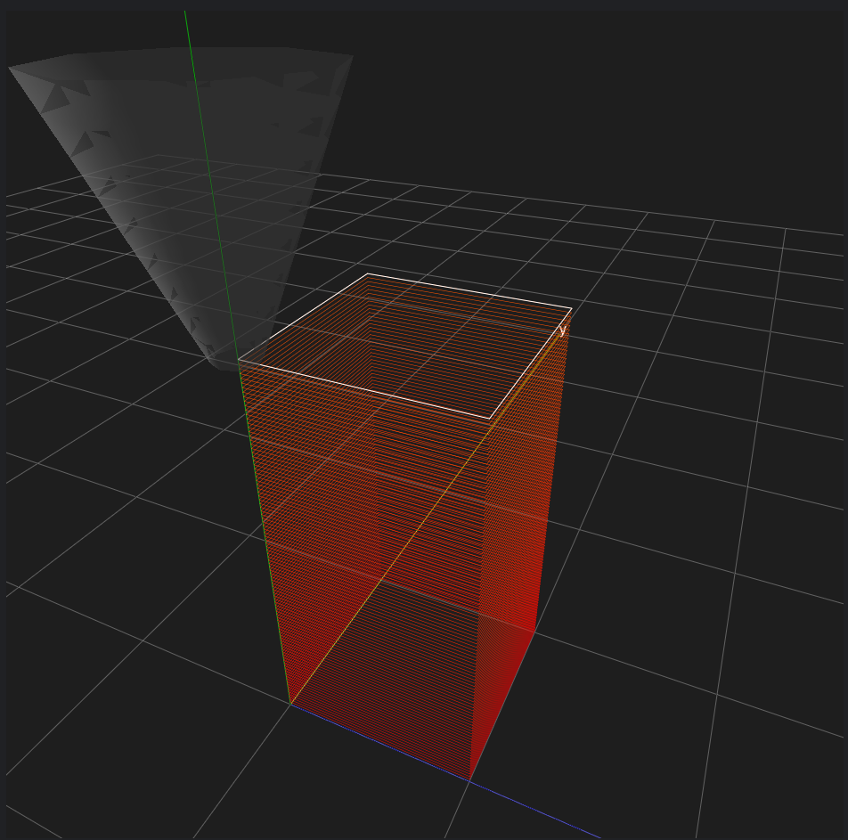

Recatngle Wall
================

As you may know, in 3D printing, a single path is not sufficient to create a three-dimensional object because the printing process involves layering. 
It is necessary to stack the paths vertically. 

This can be achieved by using a for loop to increment the z-coordinate sequence for each path, effectively raising them one on top of the other.

.. code-block:: python

    import gcoordinator as gc
    full_object = []

    for height in range(100):
        x = [0, 10.0, 10.0, 0, 0]
        y = [0, 0, 10.0, 10.0, 0]
        z = [(height+1)*0.2] * 5
        path = gc.Path(x, y, z)
        full_object.append(path)
    gc.gui_export(full_object)

In the Z-coordinate sequence, I am creating a sequence of coordinates with the same number of terms as the X-coordinate sequence, 
where the values are set to (height+1)*0.2. 

Adding 1 to the height is done within a for loop to ensure that even when the height starts from 0, the Z-coordinate begins at 0.2. 

The value 0.2 is provided as an example of a typical layer thickness.