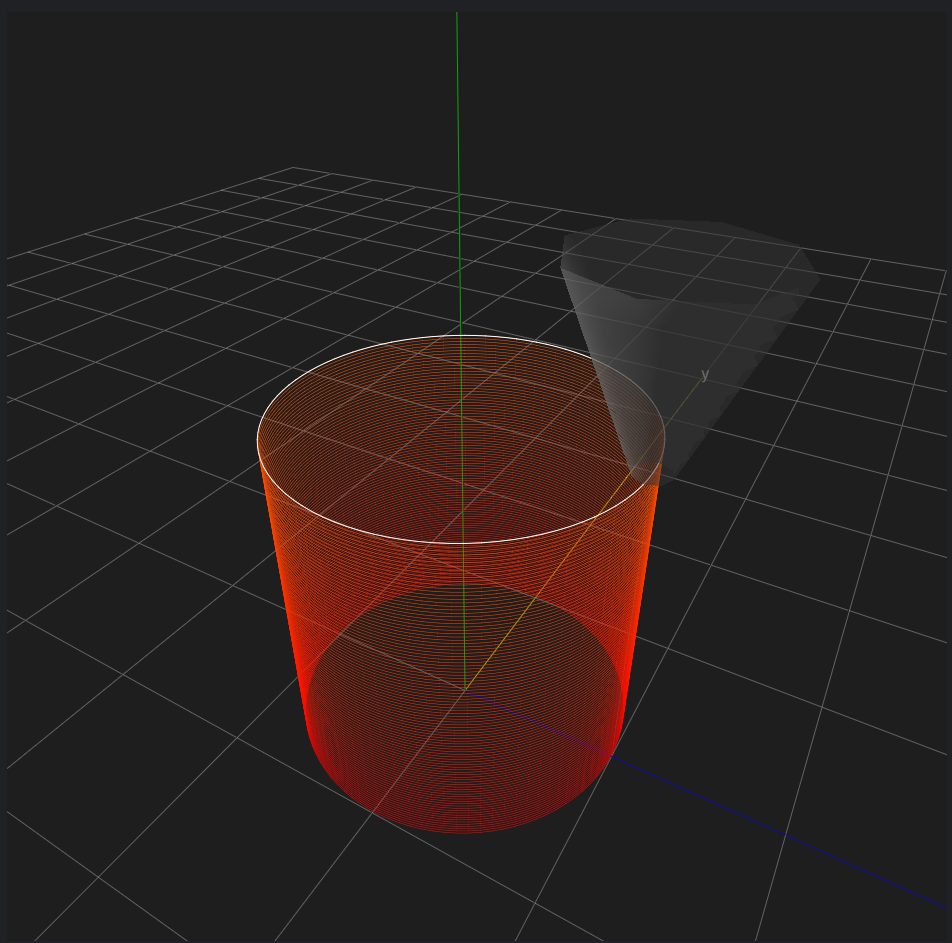

Cylinder Wall 
=================

Next, let's try sculpting a slightly more complex cylinder. 
This can be achieved by making the vertices of the previous rectangular prism large enough. 
Since there are a considerable number of vertices, we will use NumPy to create the coordinate sequence.

A cylinder (precisely a regular 99-gon) can be sculpted using the following code:

.. code-block:: python

    import numpy as np
    import gcoordinator as gc

    full_object=[]
    for height in range(100):
        arg = np.linspace(0, 2*np.pi, 100)
        x = 10 * np.cos(arg)
        y = 10 * np.sin(arg)
        z = np.full_like(arg, (height+1) * 0.2)
        wall = gc.Path(x, y, z)
        full_object.append(wall)
    
    gc.gui_export(full_object)

The code creates a sequence named 'arg,' consisting of 100 angles ranging from 0 to 2π. 

The x-coordinate sequence is obtained by multiplying the cosine of each angle by the radius, and the y-coordinate sequence is obtained by multiplying the sine of each angle by the radius. 

The z-coordinate sequence follows the same pattern as before, incrementing by 0.2 for each height unit in line with the x and y-coordinate sequences.

