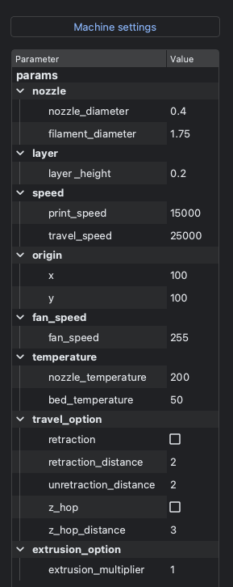

Print Settings
================

G-coordinator (GUI application) 
-------------------------------

The print settings currently allow you to specify the parameters as shown in the image below.

There are some important points to note regarding these parameters:

- layer_height: Since it is the value used to calculate the extrusion amount, it needs to be aligned with the layer pitch.
- speed: the unit is in mm/min.
- fan speed is represented by values ranging from 0 to 255.
- The origin value indicates the shift amount from the origin. In typical 3D printers, the origin is set at the front left of the bed. However, in G-coordinator, the origin is set at the center of the bed for the simplicity of writing the formulation. For example, if the bed of the 3D printer is 200mm × 200mm, the center (100, 100) is set as the origin. The coordinates (10, -20) in G-coordinator will be recorded as (110, 80) in G-code.
- extrusion_multiplier represents the filament extrusion coefficient.

These values are the basic settings applied by default to all paths for printing.

However, there are often situations where you want to specify the conditions of the 3D printer more finely. 

Such adjustments are made in the editor.

For example, let's consider a situation where you want to increase filament extrusion for the first layer to enhance bed adhesion.

In that case, you would modify the code as follows.

.. code-block:: python
    :emphasize-lines: 11, 12

    import numpy as np
    import gcoordinator as gc

    full_object=[]
    for height in range(100):
        arg = np.linspace(0, 2*np.pi, 100)
        x = 10 * np.cos(arg)
        y = 10 * np.sin(arg)
        z = np.full_like(arg, (height+1) * 0.2)
        wall = gc.Path(x, y, z)
        if height == 0:
            wall.extrusion_multiplier = 1.2
        full_object.append(wall)
    
    gc.gui_export(full_object)

Additionally, you can individually configure other settings for each path, such as the retraction and printing speed.

.. code-block:: python

    if height == 0:
        wall.extrusion_multiplier = 1.2
        wall.retraction = True
        wall.print_speed = 3000

gcoordinator (Python library)
-----------------------------

The print settings can be configured in the same way as in the GUI application.
In the gcoordinator library, the basic settings applied to all paths are managed through the following JSON. 
Specific configurations for individual paths are also done in the code, as mentioned earlier.

:download:`base_settings.json <../../gcoordinator/settings/base_settings.json>`

.. code-block:: JSON

    {   
        "Print":{
            "nozzle": {
                "nozzle_diameter": 0.4,
                "filament_diameter": 1.75
            },
            "layer": {
                "layer_height": 0.2
            },
            "speed": {
                "print_speed": 10000,
                "travel_speed": 15000
            },
            "origin":{
                "x": 100,
                "y": 100
            },
            "fan_speed": {
                "fan_speed": 255
            },
            "temperature": {
                "nozzle_temperature": 200,
                "bed_temperature": 50
            },
            "travel_option": {
                "retraction": false,
                "retraction_distance": 2.0,
                "unretraction_distance": 2.0,
                "z_hop": false,
                "z_hop_distance": 0.4
            },
            "extrusion_option": {
                "extrusion_multiplier": 1.0,
                "absolute_extrusion": false
            }
        },
        "Hardware": {
            "kinematics": "Cartesian",
            "bed_size": {
                "bed_size_x": 200,
                "bed_size_y": 200,
                "bed_size_z": 205
            }
        },
        "Kinematics": {
            "NozzleTilt": {
                "tilt_code": "B",
                "rot_code": "A",
                "tilt_offset": 0.0,
                "rot_offset": 0
            },
            "BedTiltBC": {
                "tilt_code": "B",
                "rot_code": "C",
                "tilt_offset": 0.0,
                "rot_offset": 0,
                "div_distance": 0.5
            },
            "BedRotate": {
                "rot_code": "C",
                "rot_offset": 0.0,
                "div_distance": 0.5
            }
        }
    }

By downloading and adjusting the JSON file, specifying its path in advance allows it to be loaded as the global print settings.

.. code-block:: python

    import gcoordinator as gc
    gc.load_settings("path/to/base_settings.json")

When using a GUI application, there's no need to specify the JSON path, as the values of the parameter tree are retrieved directly.
