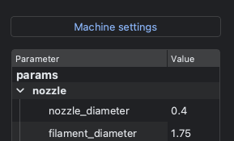
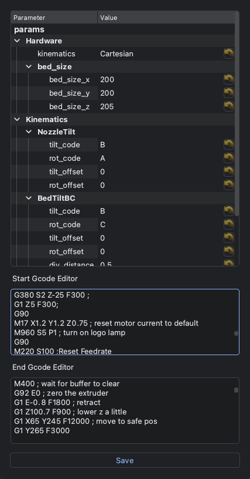

Start, End G-code
====================

G-coordinator (GUI application) 
-------------------------------

The configuration of the Start and End G-code is done within the window that pops up when you press the "machine_settings" button above the print settings.

In each field, you can simply copy and paste the Start and End G-code used by your usual slicer, for example.

After making these configuration changes, it is necessary to restart the software.

gcoordinator (Python library)
-----------------------------

To generate G-code using the library as a standalone component, you need to save the Start and End G-code in separate text files. 
Then, specify the paths to these saved text files to generate the G-code. 

The procedure is as follows:

.. code-block:: python

    import gcoordinator as gc

    # Create paths and store them in full_object

    gcode = gc.GCode(full_object)
    gcode.start_gcode("path/to/start_gcode.txt")
    gcode.end_gcode("path/to/end_gcode.txt")
