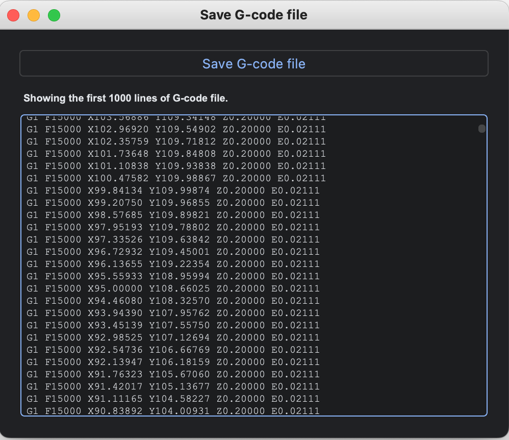

G-code exporting
=================

Through the steps outlined so far, you've been able to configure the modeling, print settings, and Start/End G-code. 
Now, all that's left is to export the G-code.

G-coordinator (GUI application) 
-------------------------------
clicking the "G-code export" button will bring up the G-code preview screen, showing only the first 1000 lines of the G-code. 

By clicking the "Save G-code file" button, you can save the generated G-code to a specified location. 
However, when saving with a custom name, it's necessary to input the file extension at the same time.

gcoordinator (Python library)
-----------------------------

To save the generated G-code using the library, you can call the save method on the GCode object you created previously.

.. code-block:: python

    gcode.save("test.gcode")

Based on the information provided so far, the code for outputting G-code using the gcoordinator library as a standalone component would look something like the following:

.. code-block:: python

    import gcoordinator as gc
    import numpy as np

    gc.load_settings('path/to/your/settings.json')

    full_object = []
    for layer in range(10):
        arg = np.linspace(0, 2*np.pi, 5)
        x = 20 * np.cos(arg)
        y = 20 * np.sin(arg)
        z = np.full_like(x, layer * 0.1)
        wall = gc.Path(x, y, z )
        outer_wall = gc.Transform.offset(wall, 0.4)
        full_object.append(wall)

    gc.show(full_object)

    gcode = gc.GCode(full_object)
    gcode.start_gcode("path/to/your/start_gcode.txt")
    gcode.end_gcode("path/to/your/end_gcode.txt")
    gcode.save('path/to/your/test.gcode')
